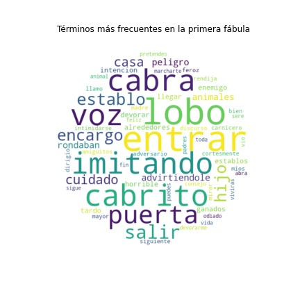

.. _caso_de_uso_2:

Caso de uso - Exploración y comparación de fábulas
==================================================

Este ejemplo muestra cómo utilizar la librería **ConTexto** para analizar textos, mediante la aplicación de técnicas de lectura, limpieza, exploración, vectorización y comparación. A continuación se muestran los pasos para importar los módulos necesarios de la librería y utilizarlos para trabajar con tres textos diferentes.

Los textos de ejemplo son tres fábulas cortas cuyos textos fueron descargados desde `aprenderespanol.org <https://aprenderespanol.org/lecturas/cuentos-breves-fabulas.html>`_, y fueron guardados en archivos de diferentes tipos.
    
El objetivo final de este ejercicio es comparar el texto de las fábulas para saber qué tanto se parecen entre sí.

Importar los paquetes y librerias necesarios
--------------------------------------------

El primer paso es importar las funciones de los módulos de interés de **ConTexto**. En este caso se importan funciones de los módulos de :py:mod:`Lectura <lectura>`, :py:mod:`Escritura <escritura>`, :py:mod:`Limpieza <limpieza>`, :py:mod:`Exploración <exploracion>`, :py:mod:`Vectorización <vectorizacion>`, y :py:mod:`Comparación <comparacion>`.

.. code-block:: python

    >>> from contexto.lectura import leer_texto
    >>> from contexto.limpieza import limpieza_texto, remover_acentos, lista_stopwords
    >>> from contexto.escritura import escribir_texto
    >>> from contexto.vectorizacion import VectorizadorFrecuencias
    >>> from contexto.comparacion import Similitud
    >>> from contexto.exploracion import nube_palabras

Leer textos de interés
----------------------

Se van a comparar las tres siguientes fábulas con métodos de analítica de texto: 

- El cabrito y el lobo. El texto está en un archivo Word con extensión .docx
- La cabra y el asno. El texto está en un archivo PDT digitalizado con extensión .pdf
- El zorro y el cuervo. El texto se encuentra en un archivo plano con extensión .txt

La extracción de los textos de cada archivo tiene una metodología distina. **ConTexto** facilita el código de importación de textos con la función :py:func:`lectura.leer_texto`.

Definir las rutas de los archivos con los textos
++++++++++++++++++++++++++++++++++++++++++++++++

En este paso se definen las rutas de los archivos que se van a importar. 

.. note::
        La carpeta `entrada <https://github.com/ucd-dnp/ConTexto/tree/master/ejemplos/entrada>`_ de la sección de ejemplos del `Repositorio de GitHub de ConTexto <https://github.com/ucd-dnp/ConTexto>`_ tiene insumos que servirán para correr varios ejemplos de la librería **ConTexto**. En este caso en particular, se va a utilizar los archivos *fábula_cabrito_y_lobo.docx*, *fábula_cabra_y_asno.pdf* y *fábula_zorro_y_cuervo.txt*.

.. code-block:: python

    >>> ruta_fabula_1 = "entrada/fábula_cabrito_y_lobo.docx"
    >>> ruta_fabula_2 = "entrada/fábula_cabra_y_asno.pdf"
    >>> ruta_fabula_3 = "entrada/fábula_zorro_y_cuervo.txt"

Leer los textos
+++++++++++++++

Si no se especifica el tipo de archivo en la función :py:func:`lectura.leer_texto`, esta observará la extensión del archivo a leer y actuará acorde a esta información.

A continuación se extrae el texto de los tres archivos, y se imprimen sus primeros 50 caracteres.

.. code-block:: python

    >>> texto_1 = leer_texto(ruta_fabula_1)
    >>> texto_2 = leer_texto(ruta_fabula_2)
    >>> texto_3 = leer_texto(ruta_fabula_3)
    
    >>> print('----- Primeros 50 caracteres de cada texto:')
    >>> print(f'* Fábula 1: {texto_1[:50]}')
    >>> print(f'* Fábula 2: {texto_2[:50]}')
    >>> print(f'* Fábula 3: {texto_3[:50]}')

    ----- Primeros 50 caracteres de cada texto:
    * Fábula 1: El cabrito y el lobo

    Al salir la cabra de su esta
    * Fábula 2: La cabra y el asno 

    Un campesino alimentaba al mi
    * Fábula 3: El Zorro y El Cuervo

    Cierto cuervo, de los feos e

Preprocesamiento de textos
--------------------------

El preprocesamiento de los textos es un paso importante para reducir ruido del texto original que puedan entorpecer los análisis a realizar, y en general adecuar los textos de entrada para poder aprovecharlos mejor.   

En este caso, se utilizaron las funciones :py:func:`limpieza.remover_acentos` para eliminar los acentos y :py:func:`limpieza.limpieza_texto` para el resto del preprocesamiento. Vale la pena mencionar que también es posible quitar los acentos desde la función :py:func:`limpieza.limpieza_texto` si se utiliza el parámetro `quitar_acentos=True`.

Crear una lista de Python con los tres textos
+++++++++++++++++++++++++++++++++++++++++++++

Se crea la lista `lista_fabulas` con los tres textos a analizar.

.. code-block:: python

    >>> lista_fabulas = [texto_1, texto_2, texto_3]

Quitar acentos de los textos
++++++++++++++++++++++++++++

.. code-block:: python

    >>> lista_fabulas = [remover_acentos(q) for q in lista_fabulas]

Pasar textos minúsculas, quitar puntuación y stopwords
++++++++++++++++++++++++++++++++++++++++++++++++++++++

A continuación se pasa el texto a minúsculas, se quita la puntuación y se eliminan stopwords con la función :py:func:`limpieza.limpieza_texto`. Los stopwords se cargan por medio de la función :py:func:`limpieza.lista_stopwords`, del módulo :py:mod:`Limpieza <limpieza>`.

.. code-block:: python

    >>> # Lista de stopwords comunes en español
    >>> sw = lista_stopwords()
    
    >>> # Limpiar el texto con la función 'limpieza_texto'
    >>> lista_fabulas_limpios = [limpieza_texto(t, lista_palabras=sw) for t in lista_fabulas]
    
    >>> # Mostrar el texto limpio de la primera fábula
    >>> lista_fabulas_limpios[0]

    'cabrito lobo salir cabra establo encargo hijo cuidado casa advirtiendole peligro animales rondaban alrededores intencion entrar establos devorar ganados tardo llegar enemigo lobo horrible amiguitos mios lobo imitando voz cabra llamo cortesmente puerta entrar mirar cabrito rendija vio feroz carnicero intimidarse dirigio siguiente discurso bien mayor adversario imitando voz madre pretendes entrar devorarme puedes marcharte odiado animal sere abra puerta sigue consejo padres viviras feliz toda vida fin'

Guardar textos en archivos .txt para ser utilizados luego
+++++++++++++++++++++++++++++++++++++++++++++++++++++++++

Luego de hacer el preprocesamiento se decide guardar los textos preprocesados en archivos '.txt' para ser utilizados luego. Si bien en este ejemplo los textos se extrajeron y limpiaron con mucha rapidez, en muchos casos este proceso puede tomar varias horas por cuenta de la longitud del texto y el tipo de preprocesamiento (puede incluirse corrección ortográfica o lematización, por ejemplo). La extracción de textos con OCR de archivos escaneados con una extensión muy larga puede ser extremadamente lenta, por lo cual guardar los resultados parciales puede ser una muy buena práctica.

Para guardar los textos en nuevos archivos, se utiliza la función :py:func:`escritura.escribir_texto`, del módulo :py:mod:`Escritura <escritura>`.

.. code-block:: python

    >>> import os
    >>> from contexto.utils.auxiliares import verificar_crear_dir
    
    >>> # Crear directorio de salida
    >>> dir_salida = 'salida/fábulas_limpias/'
    >>> verificar_crear_dir(dir_salida)
    
    >>> for i, texto in enumerate(lista_fabulas_limpios):
    >>>     escribir_texto(os.sep.join([dir_salida, f'{i+1}.txt']), texto)

Visualización de textos
-----------------------

Como método de exploración se crea una nube de palabras para la fábula 'El cabrito y el lobo'. Esto se puede hacer por medio de la función :py:func:`exploracion.nube_palabras`, del módulo :py:mod:`Exploración <exploracion>`.

En este caso, el preprocesamiento previo ayuda a quitar palabras como conectores y preposiciones, dejando en la nube términos que nos pueden aportar mejor conocimiento sobre el texto.

.. code-block:: python

    >>> nube_palabras(lista_fabulas_limpios[0], n_grama=1, n_terminos=100, graficar=True,
    >>>               dim_figura=(6, 6), hor = 0.9, titulo='Términos más frecuentes en la primera fábula')

Vectorización de los textos
---------------------------

La vectorización de textos consiste en convertir el texto preprocesado a una representación numérica para luego poder aplicar operaciones matemáticas. 

En este caso se vectorizarán los textos por medio de la metodología Bag Of Words (BOW) del módulo :py:mod:`Vectorización <vectorizacion>`. Este módulo también cuenta con otras metodologías como TF-IDF, hashing, Word2Vec y Doc2Vec.

Inicializar y ajustar vectorizador BOW
++++++++++++++++++++++++++++++++++++++

.. code-block:: python

    >>> v_bow = VectorizadorFrecuencias()
    >>> v_bow.ajustar(lista_fabulas_limpios)

Vectorizar los textos
+++++++++++++++++++++

.. code-block:: python

    >>> bow_fabulas = v_bow.vectorizar(lista_fabulas_limpios)
    >>> bow_fabulas.shape

    (3, 174)

Cálculo de similitud de textos
------------------------------

Una vez definidos los vectores de los tres textos, es posible aplicar metodologías de comparación de textos. En este caso se utilizará la similitud coseno. Esta es una de las muchas metodologías de comparación de textos que se puede hacer con **ConTexto**.

Inicializar la clase 'Similitud' de ConTexto
++++++++++++++++++++++++++++++++++++++++++++

Se inicia la clase Similitud con el vectorizador de bag of words definido en el paso anterior.

.. code-block:: python

    >>> s_bow = Similitud(v_bow)

Calcular la matriz de similitudes coseno entre los tres textos
++++++++++++++++++++++++++++++++++++++++++++++++++++++++++++++

.. code-block:: python

    >>> coseno_bow = s_bow.coseno(lista_fabulas_limpios)
    
    >>> # Convertir a dataframe de pandas
    >>> import pandas as pd
    >>> fabulas = ["el cabrito y el lobo", "la cabra y el asno", "el zorro y el cuervo"]
    >>> coseno_bow = pd.DataFrame(coseno_bow, index=fabulas, columns=fabulas)
    >>> coseno_bow

====================  ==================== ================== ====================
Index                 el cabrito y el lobo la cabra y el asno el zorro y el cuervo
====================  ==================== ================== ====================
el cabrito y el lobo  1.000000             0.162288           0.070675
la cabra y el asno    0.162288             1.000000           0.036867
el zorro y el cuervo  0.070675             0.036867           1.000000
====================  ==================== ================== ====================
