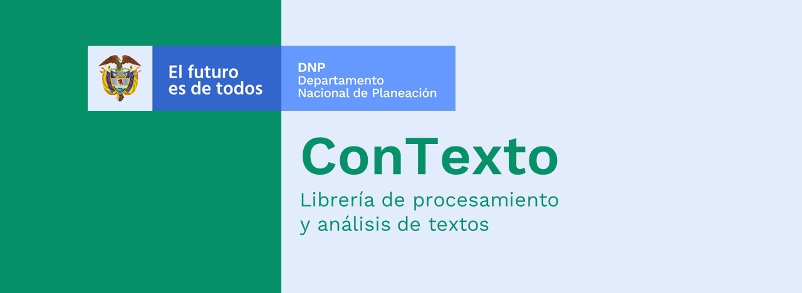

Documentación ConTexto
======================

.. |br| raw:: html

    

.. toctree::
   :maxdepth: 2
   :caption: ConTexto:   
   :hidden:

   _primeros_pasos
   _documentacion
   genindex
   _contribuciones

.. image:: https://badge.fury.io/py/ConTexto.svg
  :target: https://pypi.org/project/ConTexto/)
  :alt:

.. image:: https://img.shields.io/pypi/pyversions/ConTexto.svg
  :target: https://pypi.org/project/ConTexto/)
  :alt:

.. image:: https://img.shields.io/pypi/l/ConTexto.svg
  :target: https://pypi.org/project/ConTexto/)
  :alt:

.. image:: https://pepy.tech/badge/contexto
  :target: https://pepy.tech/project/contexto)
  :alt:

.. image:: https://img.shields.io/github/forks/ucd-dnp/ConTexto.svg?style=social&label=Fork&maxAge=2592000
  :target: https://github.com/ucd-dnp/ConTexto/)
  :alt:

|br|

.. include:: seccion_introduccion.rst
   :start-line: 5